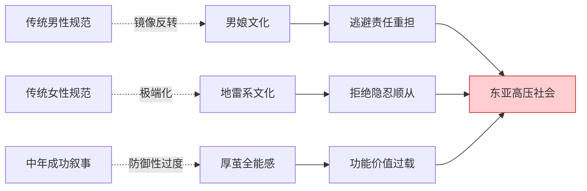
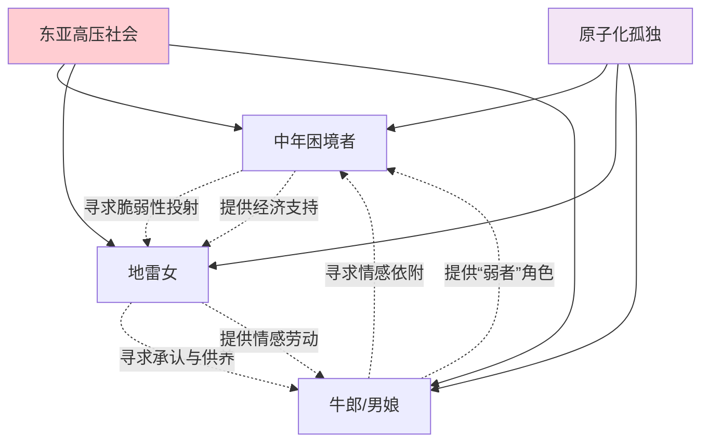

# 性别表演研究 MOC

> [!abstract] 主题概述
> 本MOC聚焦于日本亚文化中的性别流动现象，分析**男娘**（生理男性的女性化表演）、**地雷系**（精神病态美学）、**中年困境**（功能性价值危机）三者的结构性对称关系，揭示东亚高压社会中性别表演的深层动机。

---

## 🎯 核心理论框架

### 性别作为表演（Judith Butler）

**核心观点**:
- 性别不是"本质"，而是**重复性的表演**
- 通过日常行为、装扮、话语不断"做"(doing)出性别
- 表演可以被颠覆、重构、挪用

**日本亚文化应用**:
- **男娘**: 生理男性表演"女性气质"
- **地雷系**: 女性表演"病态脆弱"
- **中年人**: 表演"全能感"和"厚茧"防御

**理论来源**:
- Judith Butler《性别麻烦》(Gender Trouble, 1990)
- 东亚脉络化改造（儒家性别秩序的反向操作）

---

### 东亚特殊性：儒家性别秩序的镜像反转

**传统儒家性别规范**:

| 男性角色 | 女性角色 |
|---------|---------|
| 刚强坚毅 | 温柔顺从 |
| 承担责任 | 依附男性 |
| 克制情感 | 情感外露 |
| 社会成功 | 家庭贤惠 |

**亚文化的反向操作**:



**为何在东亚文化圈耦合度特别高**:
1. **单一社会标准** - 成功定义狭窄
2. **极高竞争成本** - 内卷压力巨大
3. **极低心理支持** - 缺乏情感宣泄渠道
4. **集体主义压抑** - 个体性被抹杀

结果：**性别表演成为心理反弹的出口**

---

## 👥 三大群体分析

### 1️⃣ 男娘文化 (Otokonoko)

**定义**:
生理男性通过女装、化妆、行为模式表演女性气质的亚文化现象。

**核心特征**:
- 🎭 **审美选择**: 不一定认同为女性（区别于跨性别）
- 💄 **地雷妆兼容**: 地雷系妆容可修饰男性骨骼特征
- 🛡️ **防御机制**: 通过"变弱"逃避传统男性角色重担
- 💬 **受害者叙事**: 与地雷女的"我很脆弱"形成共鸣

**深层动机**:

| 层面 | 传统男性压力 | 男娘的逃避策略 |
|-----|------------|--------------|
| 经济 | 养家糊口重担 | "我是女孩子，不需要赚钱" |
| 情感 | 禁止示弱哭泣 | 女性化允许情感表达 |
| 社会 | 竞争成功压力 | 退出竞争赛道 |
| 身体 | 肌肉化阳刚 | 纤细柔弱审美 |

**典型案例**:
- 程序员女装文化（中国互联网）
- Vtuber男娘角色（日本虚拟主播）
- Crossdressing Cafe（日本女装咖啡厅）

**心理机制**:
- **弱化攻击性** - 通过"可爱"化解社会敌意
- **角色实验** - 在安全空间尝试不同身份
- **逃避惩罚** - 社会对"弱者"更宽容

**相关文档**: [[男娘与程序员女装文化分析]]

---

### 2️⃣ 地雷系文化 (Jirai Kei)

**定义**:
以"精神病态美学"为核心的女性亚文化，通过黑色蕾丝、自残伤痕、病弱妆容展示脆弱性。

**核心特征**:
- 🖤 **视觉符号**: 黑色蕾丝、哥特风、绷带、创可贴
- 💔 **心理投射**: "我很脆弱，随时会崩溃"
- 🔪 **自残展示**: 手腕伤痕作为身份标识
- 🎀 **病态可爱**: Yami-kawaii（病娇可爱）美学

**深层动机**:

| 层面 | 传统女性压力 | 地雷系的反抗策略 |
|-----|------------|----------------|
| 外貌 | 清纯可爱标准 | 病态美学颠覆 |
| 情感 | 隐忍顺从 | 情绪外显极端化 |
| 关系 | 讨好男性 | "我有病，你得哄我" |
| 经济 | 依附供养 | 反向剥削（供养牛郎）|

**心理机制**:
- **脆弱性投射** - 通过展示"尖刺"保护内心
- **承认欲望** - SNS时代的关注经济
- **创伤性连接** - 与牛郎等建立共依附关系

**社会功能**:
1. **逃避期待**: "我有病"成为拒绝社会规范的理由
2. **获取关注**: 病态审美在SNS获得高流量
3. **权力反转**: 从被动受害者到主动展示脆弱

**相关文档**:
- [[中年困境与地雷女的对称性_Gemini_2026-01-17]] ⭐最深刻
- [[边缘关系的"准家人"剥削逻辑_Gemini_2026-01-17]]

---

### 3️⃣ 中年困境 (Middle-Age Crisis)

**定义**:
功能性价值压倒存在性价值，导致的身份危机与防御机制过度。

**核心特征**:
- 🏠 **功能标签**: 房车票子、职位头衔
- 🛡️ **厚茧防御**: 全能感补偿机制
- 🎭 **表演疲惫**: 持续扮演"成功者"角色
- 💔 **自我疏离**: 不知道"真实的我"是谁

**深层动机**:

| 维度 | 中年人的"厚茧" | 地雷女的"尖刺" | 结构对称性 |
|-----|--------------|--------------|----------|
| 防御机制 | 全能感补偿 | 脆弱性投射 | 都是极端化表演 |
| 核心恐惧 | 失控/无能 | 被抛弃/无价值 | 都是存在性焦虑 |
| 社会展示 | 房车票子 | 自残伤痕 | 都是符号化标签 |
| 最终后果 | 自我疏离 | 关系毁损 | 都是存在性虚无 |

**心理机制**:
- **功能性自尊** - 通过外部成就证明价值
- **存在性自尊缺失** - 不知道"我是谁"
- **全能感防御** - 害怕暴露脆弱

**文学案例**:
- 《瑞克和莫蒂》- 瑞克的全能感与深层虚无
- 《人间失格》- 叶藏的面具人生
- 《明天我会成为谁的女友》- 女主角的自我毁灭

**相关文档**: [[中年困境与地雷女的对称性_Gemini_2026-01-17]]

---

## 🔄 供需关系闭环

### 三方如何互相吸引？



### 供需匹配机制

**中年困境者 × 地雷女**:
- 中年人需要: 展示"保护弱者"的全能感
- 地雷女需要: 经济支持与"被拯救"叙事
- 交易形式: 包养、援交、Sugar Daddy
- 心理满足: 双方都逃避真实自我

**地雷女 × 牛郎/男娘**:
- 地雷女需要: 被无条件接纳的"准家人"
- 牛郎需要: 经济收入与情感依附
- 交易形式: 売掛金、香槟塔消费
- 心理满足: [[共依附关系]]的病态循环

**牛郎/男娘 × 中年困境者**:
- 牛郎需要: 稳定金主（中年女性客户）
- 中年女性需要: 年轻男性的情感劳动
- 交易形式: 定期消费、生日活动
- 心理满足: 重回青春的幻觉

---

## 🌏 东亚文化圈对比

### 为何这些现象在东亚耦合度特别高？

| 因素 | 日本 | 韩国 | 中国 | 西方对比 |
|-----|------|------|------|---------|
| **性别秩序** | 儒家残余强 | 最保守 | 快速变化 | 多元化 |
| **集体主义** | 强（和文化）| 极强 | 中等 | 弱 |
| **竞争压力** | 高（内卷）| 极高 | 极高 | 中等 |
| **情感出口** | 极少 | 极少 | 少 | 多 |
| **亚文化产业化** | 高度发达 | 发展中 | 快速增长 | 小众 |

**结论**:
- 单一社会标准 × 极高竞争 × 低心理支持 = **性别表演高发区**
- 东亚不是特殊案例，而是**现代性困境的加速样本**

---

### 相关现象对比

| 现象 | 日本 | 韩国 | 中国 |
|-----|------|------|------|
| **男性女性化** | 男娘 (Otokonoko) | 花美男 (꽃미남) | 娘炮争议 |
| **女性边缘美学** | 地雷系 (Jirai Kei) | 병약 (病弱美学) | 病娇文化 |
| **情感消费产业** | 牛郎店 | 룸살롱/오빠부대 | 夜店营销/男德班 |
| **债务陷阱** | 売掛金 | 카드빚 (卡债) | 校园贷/套路贷 |

**共同点**:
- 都利用[[原子化个体]]的孤独
- 都使用[[変動比例強化]]的成瘾机制
- 都构建"准家人"的情感操纵
- 都形成经济剥削闭环

---

## 📚 核心文档

### 性别表演三部曲
1. [[男娘与程序员女装文化分析]] - 男性女性化分析
2. [[中年困境、男娘、地雷妹的联系_Gemini_2026-01-17]] - 跨代际跨性别系统分析
3. [[中年困境与地雷女的对称性_Gemini_2026-01-17]] ⭐ 最深刻的哲学分析

### 理论基础
- [[现代性幸存者：原子化、系统寄生与审美防御的结构性分析]] - 提供理论框架
- [[寄生心理：原子化与系统控制_Gemini_2026-01-17]] - 心理机制

### 相关主题
- [[MOC - 经济剥削机制]] - 牛郎产业的经济分析
- [[MOC - 心理控制机制]] - 成瘾与操纵机制
- [[边缘关系的"准家人"剥削逻辑_Gemini_2026-01-17]] - 情感操纵

---

## 🔑 关键概念

### 理论概念
- **性别表演** (Gender Performance) - Judith Butler理论
- **儒家性别秩序** - 东亚传统性别规范
- **镜像反转** - 亚文化对传统的颠覆
- **功能性价值 vs 存在性价值** - 身份危机根源

### 群体概念
- **男娘** (Otokonoko) - 生理男性女性化
- **地雷系** (Jirai Kei) - 精神病态美学
- **中年困境** - 功能性价值过载

### 心理概念
- **全能感防御** - 中年人的"厚茧"
- **脆弱性投射** - 地雷女的"尖刺"
- **弱化攻击性** - 男娘的生存策略
- [[存在性自尊]] - 核心缺失

### 社会概念
- [[原子化个体]] - 社会孤立根源
- **东亚高压社会** - 文化特殊性
- **承认欲望** - SNS时代认同危机
- **准家人关系** - 情感操纵工具

---

## 💡 理论贡献

### 对性别研究的贡献

**1. 超越二元对立**
- 不再是"男性 vs 女性"
- 而是"表演策略 A vs 表演策略 B"
- 性别成为**应对社会压力的工具箱**

**2. 东亚化的Butler理论**
- 性别表演不仅是文化建构
- 更是**阶级、经济、代际压力的综合产物**
- 儒家秩序提供了"反向操作"的参照系

**3. 结构性对称的发现**
- 中年困境（全能感）↔ 地雷女（脆弱性）
- 本质都是**存在性价值缺失**的不同表现
- 揭示现代性危机的普遍性

---

### 对亚文化研究的贡献

**1. 系统性分析框架**
```
社会结构压力
    ↓
性别角色重担
    ↓
表演性逃避策略
    ↓
    ├→ 男娘（弱化策略）
    ├→ 地雷女（极端化策略）
    └→ 中年人（过度补偿策略）
```

**2. 跨领域整合**
- 性别研究 + 经济剥削分析
- 心理机制 + 社会学视角
- 文化现象 + 结构性批判

**3. 实践导向**
- 不仅是学术分析
- 提供**脱钩路径**和**干预策略**
- 指向**社会系统改革**

---

## 🛠️ 研究方法

### 理论工具

**1. 社会学**
- 功能主义（社会角色）
- 冲突理论（阶级压力）
- 符号互动论（表演性）

**2. 心理学**
- 发展心理学（身份认同）
- 社会心理学（群体动力）
- 精神分析（防御机制）

**3. 文化研究**
- 后结构主义（解构性别）
- 亚文化理论（抵抗与收编）
- 批判理论（意识形态批判）

---

### 分析维度

**三层分析框架**:

1. **宏观层面**（社会结构）
   - 东亚文化圈的特殊性
   - 资本主义现代性压力
   - 性别秩序的历史演变

2. **中观层面**（群体互动）
   - 三大群体的供需关系
   - 亚文化产业化机制
   - 符号经济与情感劳动

3. **微观层面**（个体心理）
   - 身份认同危机
   - 防御机制与表演策略
   - 脱钩可能性与限制

---

## 🔗 导航

**⬆️ 返回**: [[_INDEX|日本亚文化研究索引]]
**↔️ 相关MOC**: [[MOC - 经济剥削机制]] | [[MOC - 心理控制机制]]
**📍 推荐阅读**: [[中年困境与地雷女的对称性_Gemini_2026-01-17]]

---

## 📝 维护信息

**创建日期**: 2026-02-07
**最后更新**: 2026-02-07
**文档状态**: ✅已完成
**版本**: v1.0

---

> [!quote] 核心洞察
> "性别不是你是什么，而是你在社会压力下**选择表演什么**。
>
> 男娘、地雷女、中年困境者——都是现代性困境下的**生存策略**，
>
> 不应被道德化评判，而应从**结构性视角**理解其必然性。"
