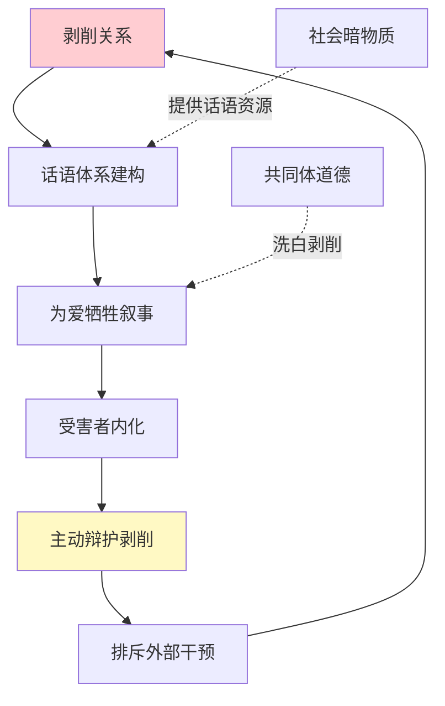
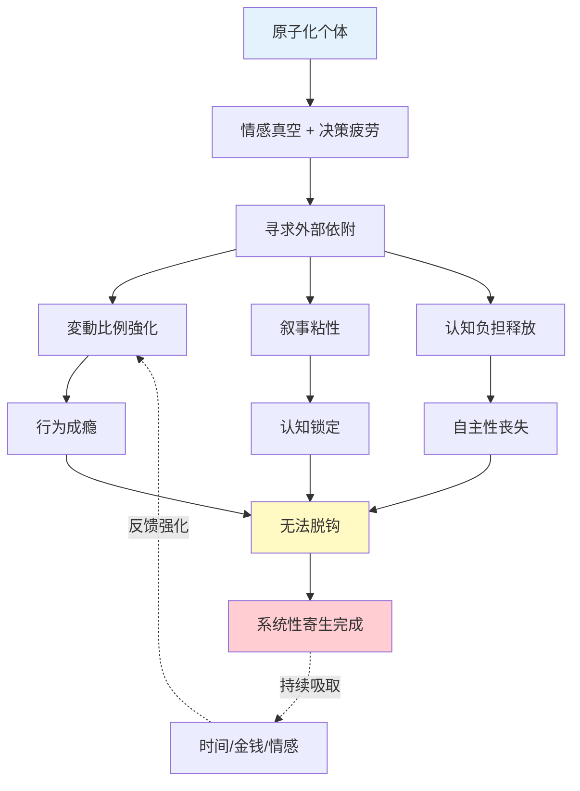

# 心理控制机制 MOC

> [!abstract] 主题概述
> 本MOC整合系统性寄生的心理与行为机制研究，揭示**変動比例強化**（间歇性强化）、**叙事粘性**（话语锁定）、**认知负担释放**如何构建难以逃离的成瘾陷阱。

---

## 🎯 核心理论基础

### 斯金纳箱与操作性条件作用

**经典实验**:
- B.F. Skinner（1930s）的鸽子实验
- 发现**变动比例强化**（Variable Ratio Schedule）最难消退

**基本原理**:
```
固定奖励（可预测） → 容易适应，失去吸引力
变动奖励（不可预测） → 持续期待，难以戒断
```

**人类应用场景**:
- 🎰 老虎机（赌博成瘾）
- 📱 社交媒体（点赞不确定性）
- 💑 情感关系（冷热交替）
- 🐕 养宠物（比格犬的间歇性回应）
- 👔 牛郎店（売掛金的不确定回报）

**理论来源**: [[剥削、成瘾与脱钩之路]]

---

### 変動比例強化 (Variable Ratio Reinforcement)

**定义**:
奖励以**不可预测的频率**出现，受试者必须持续投入才有可能获得奖励。

**数学特征**:
- 平均强化比例: N次行为 → 1次奖励
- 但具体哪次获得奖励**完全随机**
- 导致持续高频行为

**心理机制**:

| 阶段 | 心理状态 | 行为模式 |
|-----|---------|---------|
| 初期 | "这次可能有回报！" | 高频尝试 |
| 中期 | "已经投入这么多..." | 沉没成本陷阱 |
| 晚期 | "不能放弃，马上就要成功" | 病态坚持 |

**典型案例对比**:

#### 案例1: 比格犬
- **强化源**: 主人偶尔的关注
- **行为**: 持续吠叫、破坏
- **原子人反应**: 间歇性回应（有时骂，有时哄）
- **结果**: 狗的行为强化，主人疲惫

#### 案例2: 地雷女与牛郎
- **强化源**: 牛郎的情感回馈
- **行为**: 持续消费、売掛金累积
- **牛郎策略**: 冷热交替（消费多→热情，少→冷淡）
- **结果**: 女性成瘾性消费，债务陷阱

#### 案例3: SM关系中的奴隶
- **强化源**: Dom的"认可"
- **行为**: 持续服从、自我降格
- **Dom策略**: 偶尔给予"好孩子"评价
- **结果**: 完全人格控制

---

### 叙事粘性 (Narrative Stickiness)

**定义**:
通过话语体系构建的**认知锁定机制**，使受害者主动为剥削关系辩护。

**理论基础**:
- 福柯的话语权力理论
- 葛兰西的文化霸权
- 社会建构主义

**运作机制**:



**六大洗白话术**:

1. **"为爱牺牲"**
   - 地雷女: "我是真心爱他的"
   - SM奴隶: "这是我自愿的奉献"
   - 牛郎消费: "为了他的梦想"

2. **"他也很痛苦"**
   - "他也不想让我去做性工作"
   - "他承受着巨大压力"
   - 施害者与受害者界限模糊

3. **"我有特殊性"**
   - "我们的关系外人不懂"
   - "这是真爱，不是剥削"
   - 拒绝结构性分析

4. **"我能改变他"**
   - 拯救者情结
   - 延迟满足的永恒承诺
   - "再坚持一下就好了"

5. **"我已经投入太多"**
   - 沉没成本谬误
   - "不能让之前的付出白费"
   - 理性决策能力崩溃

6. **"离开会更糟"**
   - 习得性无助
   - "没有他我什么都不是"
   - 自我价值完全依附

**破解策略**:
- 识别话语的社会建构性
- 引入外部视角（NGO、心理咨询）
- 重建独立自我叙事

---

### 认知负担释放 (Cognitive Load Relief)

**定义**:
个体主动将决策权转让给系统/他人，以换取**心理轻松感**。

**心理学基础**:
- 决策疲劳（Decision Fatigue）
- 习得性无助（Learned Helplessness）
- 自我耗竭理论（Ego Depletion）

**为何人会主动进入剥削关系？**

| 原子化社会压力 | 认知负担 | 逃避策略 | 剥削形式 |
|-------------|---------|---------|---------|
| 职业选择焦虑 | 极高 | 放弃自主，听从Dom | SM关系 |
| 情感孤独 | 极高 | 全权信任牛郎 | 牛郎消费 |
| 生存压力 | 极高 | 依附强势者 | 包养关系 |

**核心逻辑**:
```
现代性压力 → 决策疲劳 → 寻求"简化"
                         ↓
                  "你决定就好"
                         ↓
                  权力全面转让
                         ↓
                  认知负担释放（短期）
                         ↓
                  完全控制（长期）
```

**案例分析**:

**家教变成SM奴隶的心理路径**:
1. **初期**: 高学历，强自主性
2. **压力期**: 职业选择焦虑，人生方向迷茫
3. **接触期**: Dom提供"明确指令"（你只需服从）
4. **沉迷期**: 享受"不用思考"的轻松感
5. **锁定期**: 完全放弃自主决策能力
6. **崩溃期**: 意识到陷阱但无力逃离

**理论来源**: [[剥削、成瘾与脱钩之路]]

---

## 🔄 三大机制的协同作用

### 系统性寄生的完整模型



---

### 递进逻辑：从混乱到毁灭

**三阶段演化**（引自[[亚文化符号的深层联系]]）:

| 阶段 | 核心机制 | 典型案例 | 症状 |
|-----|---------|---------|------|
| **阶段1: 混乱填补虚无** | 変動比例強化 | 原子人养比格犬 | 用混乱对抗空虚 |
| **阶段2: 牺牲确认价值** | 叙事粘性 | 地雷女供养牛郎 | 用付出证明存在 |
| **阶段3: 自我毁灭获解脱** | 认知负担释放 | 家教变SM奴隶 | 用服从逃避选择 |

**递进特征**:
- 控制程度: 低 → 中 → 高
- 可逆性: 容易 → 困难 → 极难
- 自我毁损: 轻微 → 严重 → 极端

---

## 🧠 心理机制详解

### 意义窄化与生存极简化

**定义**:
个体的意义来源被压缩到**单一对象/活动**，形成病态依赖。

**演化路径**:

```
正常状态: 意义来源多元（工作+家庭+爱好+社交）
    ↓
原子化: 社会连接断裂（只剩工作/只剩一个人）
    ↓
意义窄化: 全部意义投射到单一对象
    ↓
生存极简化: "没有X我活不下去"
    ↓
系统性寄生: X成为绝对控制者
```

**案例对比**:

| 群体 | 意义窄化对象 | 生存极简化表现 |
|-----|------------|--------------|
| 原子人 | 比格犬 | "没有狗我会更孤独" |
| 地雷女 | 牛郎 | "他是我活下去的理由" |
| SM奴隶 | Dom | "服从主人是我的存在价值" |
| 中年困境者 | 房车票子 | "没有这些我一无是处" |

---

### 多巴胺操纵与神经化学控制

**神经科学基础**:
- 多巴胺 ≠ 快乐激素
- 多巴胺 = **期待激素**（wanting vs liking）

**变动强化的神经机制**:

| 奖励模式 | 多巴胺释放 | 成瘾性 |
|---------|-----------|--------|
| 固定奖励 | 初期高，后期平稳 | 低 |
| 变动奖励 | 持续高峰 | 极高 |
| 无奖励 | 快速下降 | 无 |

**牛郎店的多巴胺设计**:
1. **初次**: 大量关注 → 多巴胺爆发
2. **第二次**: 冷淡对待 → 多巴胺骤降 → 焦虑
3. **第三次**: 偶尔热情 → 多巴胺再次爆发 → 强化
4. **循环**: 不可预测性 → 持续期待 → 成瘾

**理论来源**:
- Robert Sapolsky《行为》
- Anna Lembke《多巴胺国度》

---

### 共同体道德洗白

**定义**:
利用群体认同和道德话语，将剥削关系合法化。

**运作机制**:

**案例1: 牛郎店的"爱情叙事"**
- 店内话语: "我们是真心相爱的"
- 群体认同: 其他地雷女也这么说
- 道德高地: "为爱付出是高尚的"
- 排斥批评: "你们不懂真爱"

**案例2: SM社群的"自愿契约"**
- 社群话语: "这是双方自愿的权力交换"
- 群体认同: BDSM社群的集体叙事
- 道德高地: "我们比vanilla更诚实"
- 排斥批评: "你们是保守的道德警察"

**福柯式分析**:
- 权力不仅是压制，更是**生产性的**
- 生产话语、生产主体、生产欲望
- 受害者成为剥削关系的**积极维护者**

---

## 🛠️ 脱钩路径与干预策略

### 个体层面：三大突破口

#### 1. 提升社会动量 m_i

**物理类比**:
```
逃离概率 P_ij ∝ exp(-β·Ψ/m_i)
社会动量 m_i ↑ → 逃离概率 ↑
```

**实践策略**:
- ✅ 重建多元社交网络（不依赖单一对象）
- ✅ 发展多样化兴趣（分散意义来源）
- ✅ 培养经济独立能力（降低经济依附）
- ✅ 加入支持性社群（NGO、互助组）

**监控指标**:
- [ ] 每周与3人以上深度交流
- [ ] 有2项以上定期兴趣活动
- [ ] 经济收入不依赖单一来源
- [ ] 能够独立做重要决策

---

#### 2. 降低逃离势垒 Ψ

**物理类比**:
```
势垒 Ψ = 沉没成本 + 社会压力 + 习得性无助
Ψ ↓ → 逃离概率 ↑
```

**实践策略**:
- ✅ 认知重构：沉没成本不是继续的理由
- ✅ 寻求法律援助：债务重组、破产保护
- ✅ 切断信息流：拉黑、删除联系方式
- ✅ 物理隔离：搬家、换工作

**心理辅助**:
- 写脱离日记（记录每天的进步）
- 寻找替代性满足（健康的情感连接）
- 专业心理咨询（处理创伤）

---

#### 3. 重建语义自主权

**理论基础**:
- 对抗[[叙事粘性]]的话语锁定
- 重建独立自我叙事

**实践策略**:

| 剥削叙事 | 反驳框架 | 新叙事 |
|---------|---------|-------|
| "为爱牺牲" | 这是结构性剥削 | "我值得平等关系" |
| "他也很痛苦" | 痛苦不是剥削的借口 | "我的痛苦更重要" |
| "我离不开他" | 这是习得性无助 | "我可以独立生活" |
| "已投入太多" | 沉没成本谬误 | "及时止损才理性" |

**工具**:
- 批判性思维训练
- 女性主义意识觉醒
- 社会学结构性分析
- 阅读脱离成功案例

---

### 社会层面：系统性改革

#### 预防机制

**1. 降低原子化程度**
- 社区中心建设
- 职场心理健康支持
- 单身友好型社会政策

**2. 提升心理韧性**
- 学校开设情感教育课程
- 识别变动强化的成瘾机制
- 批判性思维培养

**3. 金融监管**
- 禁止/限制売掛金
- 消费贷利率上限
- 破产保护制度完善

---

#### 干预机制

**1. NGO支持网络**
- **COLABO**（日本）: 女性脱离牛郎店支援
- **若草プロジェクト**: 少女保护
- 提供: 住宿、法律援助、职业培训、心理咨询

**2. 法律框架**
- 売掛金立法（2024-2025日本进行中）
- 情感劳动产业规制
- 性产业从业者保护

**3. 医疗体系**
- 成瘾治疗专科
- 创伤后应激障碍（PTSD）治疗
- 低成本心理咨询可及性

---

## 📚 核心文档

### 心理机制三部曲

1. [[寄生心理：原子化与系统控制]] - 数学模型化
2. [[剥削、成瘾与脱钩之路]] ⭐ 最系统的机制分析
3. [[亚文化符号的深层联系]] - 递进逻辑分析

### 应用案例

- [[牛郎债务驱动的性产业闭环]] - 経済剥削应用
- [[边缘关系的"准家人"剥削逻辑_Gemini_2026-01-17]] - 情感操纵应用
- [[男娘与程序员女装文化分析]] - 弱化攻击性机制

### 理论基础

- [[现代性幸存者：原子化、系统寄生与审美防御的结构性分析]] - 总体框架
- [[中年困境与地雷女的对称性]] - 存在性价值危机

---

## 🔑 关键概念

### 成瘾理论
- **変動比例強化** - 间歇性强化（核心机制）
- **多巴胺操纵** - 神经化学控制
- **意义窄化** - 病态单一依赖
- **生存极简化** - "没X活不下去"

### 认知控制
- **叙事粘性** - 话语锁定
- **共同体洗白** - 道德话语合法化
- **认知负担释放** - 主动放弃自主
- **习得性无助** - 学会的绝望

### 社会机制
- [[原子化个体]] - 孤独的社会根源
- **社会动量** - 逃离能力的物理类比
- **逃离势垒** - 沉没成本与社会压力
- **语义自主权** - 独立叙事能力

### 关系模式
- [[共依附关系]] - 病态相互依赖
- [[契约性受难]] - 主动进入剥削
- **准家人关系** - 情感操纵工具
- **创伤性连接** - 痛苦加深依恋

---

## 📖 学术来源

### 心理学经典

- **B.F. Skinner** - 操作性条件作用，变动比例强化
- **Martin Seligman** - 习得性无助理论
- **Roy Baumeister** - 自我耗竭理论
- **Robert Sapolsky** - 神经科学与行为
- **Anna Lembke** - 多巴胺与成瘾

### 社会理论

- **Michel Foucault** - 话语权力理论
- **Antonio Gramsci** - 文化霸权
- **Judith Butler** - 性别表演论（延伸应用）

### 日本学者

- **佐佐木千寻** - SNS世代的承认欲望
- **铃木凉美** - 牛郎消费的田野调查
- **阿部真大** - 情感劳动理论

---

## 🔬 研究方法

### 跨学科整合

**1. 神经科学视角**
- 多巴胺系统
- 奖励预测误差
- 神经可塑性

**2. 行为心理学**
- 操作性条件作用
- 强化程式
- 消退抵抗

**3. 认知心理学**
- 决策疲劳
- 沉没成本谬误
- 认知失调

**4. 社会心理学**
- 群体压力
- 认同需求
- 习得性无助

**5. 批判理论**
- 话语分析
- 权力结构
- 意识形态批判

---

### 分析框架

**三层结构**:

1. **微观（个体心理）**
   - 神经化学机制
   - 认知偏差
   - 情感依附

2. **中观（关系动力）**
   - 变动强化设计
   - 权力不对称
   - 共依附循环

3. **宏观（社会结构）**
   - 原子化社会
   - 资本主义剥削
   - 意义危机

---

## 💡 理论贡献

### 对成瘾研究的贡献

**1. 超越物质成瘾**
- 不仅是毒品、酒精
- **关系成瘾**、**情感成瘾**同样致命
- 机制高度相似（多巴胺+变动强化）

**2. 社会性成瘾的发现**
- 原子化社会**制造**成瘾易感性
- 商业系统**利用**成瘾机制
- 形成**结构性成瘾生态**

**3. 脱钩路径的系统化**
- 不仅是个人意志
- 需要**社会支持系统**
- 需要**结构性改革**

---

### 对社会批判的贡献

**1. 揭示现代性的心理代价**
```
现代化 → 原子化 → 意义真空
                    ↓
              寻求补偿（成瘾易感）
                    ↓
              商业剥削（牛郎/老虎机/社交媒体）
                    ↓
              更深孤独（恶性循环）
```

**2. 连接宏观与微观**
- 社会结构 ↔ 个体心理
- 不是简单的"个人选择"
- 而是**结构性困境**

**3. 实践导向**
- 不仅是学术分析
- 提供可操作的脱钩策略
- 指向社会系统改革

---

## 🔗 导航

**⬆️ 返回**: [[_INDEX|日本亚文化研究索引]]
**↔️ 相关MOC**: [[MOC - 经济剥削机制]] | [[MOC - 性别表演研究]]
**📍 推荐阅读**: [[剥削、成瘾与脱钩之路]]

---

## 📝 维护信息

**创建日期**: 2026-02-07
**最后更新**: 2026-02-07
**文档状态**: ✅已完成
**版本**: v1.0

---

> [!warning] 成瘾警示
> 变动比例强化是**最难戒断**的成瘾机制。
>
> 如果你发现自己处于以下状态：
> - 无法预测对方何时会回应你
> - 已经投入大量但总觉得"马上就要成功"
> - 其他人都说这不对，但你坚信"他们不懂"
>
> **你可能已经被锁定。** 请寻求专业帮助。

> [!tip] 脱钩第一步
> **承认自己被困住了。**
>
> 这不是软弱，而是清醒。
> 不是道德问题，而是结构性陷阱。
>
> 你值得更好的关系。
