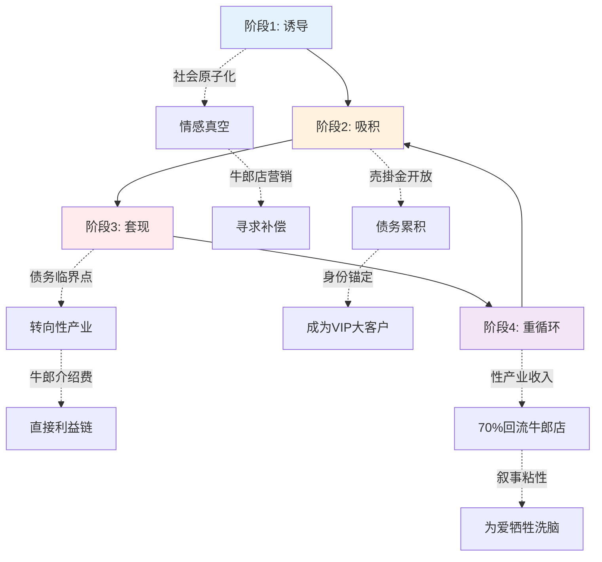

# 经济剥削机制 MOC

> [!abstract] 主题概述
> 本MOC整合日本牛郎产业的经济剥削机制研究，揭示"売掛金"（挂账）制度如何构建**债务→性产业→收入回流**的完整闭环，形成自我维持的剥削生态。

---

## 🎯 核心理论

### 非对称吸积（Law II）

当系统A（牛郎店）与Agent i（地雷女）交互时：
- 系统吸取Agent的资源（时间、金钱、情感）
- Agent获得微小增量奖励（多巴胺、虚假承认）
- 交换比例严重不对称

**数学表达**: `Δw_A = -κ·Δw_i` (κ >> 1)

**物理类比**:
- 类似热力学中的耗散系统
- 系统熵减（秩序增加），个体熵增（混乱加剧）
- 符合钱学森的开放复杂巨系统理论

**理论来源**: [[寄生心理：原子化与系统控制]]

---

### 売掛金（挂账）机制

**定义**:
牛郎店允许客户透支消费，形成债务枷锁的金融工具。

**运作方式**:
1. 初次消费给予优惠（诱饵）
2. 建立信任后开放挂账额度
3. 高价消费项目（香槟塔、生日活动）推动债务激增
4. 利息复利累积，债务雪球效应

**法律现状**:
- **2024年前**: 法律灰色地带，监管缺失
- **2024-2025年**: 日本政府开始立法规制（内阁府消费者委员会）
- **实际执行**: 困难重重（涉及黑社会势力、地下金融）

**社会影响**:
- 年轻女性个人破产率上升
- "ホスト狂い"（牛郎疯）成为社会问题
- 性产业从业者低龄化

---

## 🔄 四阶段经济闭环



---

### 阶段1: 诱导阶段

**社会条件**:
- [[原子化个体]] - 社会关系网络碎片化
- 职场性别歧视与压力
- 家庭纽带断裂
- SNS时代的[[承认欲望]]匮乏

**牛郎店策略**:
- 🎁 初次免费体验/大幅折扣
- 👑 "王子般"的情感劳动表演
- ✨ 制造"被选中"的错觉
- 📸 Instagram打卡营销（炫耀心理利用）

**心理机制**:
- 填补情感真空
- 获得即时认同感
- 逃避现实压力

**典型案例**:
20-30岁职业女性，工作压力大，缺乏真实亲密关系，通过牛郎店寻求"被重视"的感觉。

---

### 阶段2: 吸积阶段

**核心机制**:
1. **[[変動比例強化]]** - 牛郎的冷热交替
   - 有时热情（大额消费后）
   - 有时冷淡（未消费时）
   - 制造不可预测性 → 成瘾

2. **沉没成本陷阱**
   - "已经花了300万日元..."
   - "不能让之前的投入白费"
   - 理性决策能力崩溃

3. **身份锚定**
   - 成为店内"Ace"（大客户）
   - 获得VIP待遇和特权
   - 社会身份从职场转移到牛郎店

**经济手段**:
- **売掛金无限透支**: 月消费额可达100-500万日元
- **香槟塔仪式**: 单次消费50-200万日元
- **生日活动**: 集体送礼竞争（攀比心理利用）
- **指名制度**: 固定消费特定牛郎（排他性锁定）

**监控指标**:
- 月消费额 > 月收入3倍（危险信号）
- 债务总额 > 年收入（临界点）
- SNS发帖频率（牛郎店打卡密度）

---

### 阶段3: 套现阶段

**债务临界点**:
当挂账超过年收入**3-5倍**时，常规工作无法偿还

**转向路径**（按比例）:
1. **性产业** (60-70%)
   - AV（成人影片）
   - 风俗店（性服务）
   - Papakatsu（包养援交）
   - 地下性产业

2. **灰色产业** (20-30%)
   - 黑工/现金工
   - 诈骗帮凶
   - 地下经济

3. **个人破产** (10%)
   - 法律破产但仍需还款
   - 信用彻底毁灭
   - 社会边缘化

**牛郎店的"介绍费"机制**:
- 向性产业介绍客户可获**20-30%提成**
- 形成直接利益链条
- 牛郎成为"皮条客"角色
- 部分店铺与性产业有组织性合作

**实证案例**:
铃木凉美（东大社会学硕士→AV女优）在《资优》中描述自己从牛郎消费到进入AV产业的心路历程。

---

### 阶段4: 重循环阶段

**心理锁定**:
1. **[[叙事粘性]]**: "为爱牺牲"的自我洗脑
   - "他是真心爱我的"
   - "他也很痛苦（心疼我去做性工作）"
   - 受害者与施害者界限模糊

2. **[[共依附关系]]**: 病态相互依赖
   - 牛郎假装"保护"她
   - 她通过供养牛郎证明"存在价值"
   - 双方都陷入无法脱离的关系

3. **创伤性连接**: 痛苦反而加深依恋
   - 斯德哥尔摩综合症机制
   - 羞耻感强化保密需求
   - 社会孤立加剧依赖

**经济循环**:
```
性产业月收入: 50-150万日元
        ↓
扣除生活成本: 10-20万日元
        ↓
牛郎店消费: 30-120万日元（70-80%）
        ↓
实际储蓄: 接近0甚至负数
        ↓
债务减少速度 < 新增消费速度
        ↓
永久性贫困陷阱
```

**脱钩难度**:
- 心理成瘾: ⭐⭐⭐⭐⭐ (极高)
- 经济依赖: ⭐⭐⭐⭐⭐ (极高)
- 社会支持: ⭐ (极低)
- 法律保护: ⭐⭐ (有限)

---

## 📊 监控信号与预警指标

### 宏观指标

**1. 香槟塔指数**（假设性指标）
- **定义**: 牛郎店高端消费额 vs AV产业新人入行数
- **假设相关性**: 香槟塔消费↑ → 6个月后AV新人↑
- **需要**: 实证数据验证

**2. 性别化破产率**
- **观测指标**:
  - 20-35岁女性个人破产率
  - 破产理由中"娱乐消费"占比
  - 歌舞伎町周边地区集中度
- **数据来源**: 日本法院破产统计

**3. SNS话题热度**
- Twitter/X标签: `#地雷女 #売掛 #ホスト狂い`
- Instagram: 牛郎店打卡+奢侈品炫耀频率
- 债务咨询网站流量

---

### 微观信号（个体层面）

**早期预警** (可逆阶段):
- [ ] 每周去牛郎店2次以上
- [ ] 月消费超过月收入
- [ ] 开始使用信用卡透支
- [ ] SNS内容以牛郎店为主

**中期危险** (困难阶段):
- [ ] 使用売掛金挂账
- [ ] 债务超过月收入3倍
- [ ] 借消费贷/高利贷
- [ ] 向家人朋友借钱（隐瞒真实用途）

**晚期崩溃** (极难逆转):
- [ ] 债务超过年收入
- [ ] 开始考虑性产业
- [ ] 社交圈完全转移到牛郎店
- [ ] 出现自杀念头

---

## 💡 干预策略

### 预防层面（社会政策）

**1. 社会支持网络重建**
- 社区中心、女性互助组
- 职场心理健康支持
- 降低社会原子化程度

**2. 情感教育**
- 识别"假性亲密关系"
- [[変動比例強化]]的成瘾机制教育
- 健康亲密关系的建立

**3. 金融素养教育**
- 警惕売掛金陷阱
- 债务管理知识
- 消费心理学基础

---

### 早期干预（个体支持）

**1. NGO介入**
- **COLABO**: 女性支援组织（仁藤梦乃创立）
- **若草プロジェクト**: 少女支援
- 提供脱离支援、住宿、职业培训

**2. 法律援助**
- 债务重组方案
- 破产保护申请
- 劳动法律咨询

**3. 心理咨询**
- 处理[[共依附关系]]
- 创伤治疗（PTSD）
- 重建自我价值感

---

### 系统改革（立法层面）

**1. 立法规制**
- ✅ 禁止/限制売掛金（2024-2025进行中）
- ⏳ 规制情感劳动产业（讨论中）
- ⏳ 加强性产业监管（阻力大）

**2. 劳动保护**
- 缩小性别工资差距
- 反职场性骚扰
- 提高最低工资

**3. 社会保障**
- 低收入女性支持体系
- 单身女性住房支持
- 心理健康服务可及性

---

## 📚 核心文档

### 理论基础
- [[现代性幸存者：原子化、系统寄生与审美防御的结构性分析]] - 提供理论框架
- [[寄生心理：原子化与系统控制]] - 数学模型化

### 经济分析三部曲
1. [[牛郎债务驱动的性产业闭环]] ⭐ 核心文档
2. [[歌舞伎町共依附现象分析]] - 地域案例研究
3. [[日本女性牛郎消费社会学分析]] - 消费者心理

### 相关主题
- [[边缘关系的"准家人"剥削逻辑_Gemini_2026-01-17]] - 情感操纵机制
- [[剥削、成瘾与脱钩之路]] - 脱钩策略
- [[MOC - 心理控制机制]] - 成瘾心理

---

## 🔑 关键概念

### 经济概念
- **売掛金** (Urikakekin) - 挂账制度
- **非対称吸積** - 不对称资源吸取
- **香槟塔** - 高价仪式性消费
- **四阶段闭环** - 诱导→吸积→套现→重循环

### 心理概念
- [[変動比例強化]] - 间歇性强化
- [[叙事粘性]] - 话语锁定
- [[共依附关系]] - 病态依赖
- [[契约性受难]] - 主动进入剥削

### 社会概念
- [[原子化个体]] - 社会孤立
- [[情感劳动]] - 情感商品化
- [[承认欲望]] - SNS时代认同危机
- **准家人关系** - 边缘群体情感操纵

---

## 📖 学术来源

### 日本学者
- **佐佐木千寻** - 《"Pi-en"这种病：SNS世代的消费与承认欲望》
  - SNS世代的承认需求理论
  - 地雷女群体的实证研究

- **铃木凉美** - 《资优》《夜之女的社会学》
  - 东京大学社会学硕士
  - 前AV女优，提供第一手田野调查
  - 牛郎消费→性产业的个人经历

- **阿部真大** - 情感劳动理论
  - 牛郎产业的情感劳动分析
  - 服务业的情感商品化研究

### 理论工具
- **钱学森** - 开放复杂巨系统理论
- **斯金纳** - 操作性条件作用（变动比例强化）
- **马斯洛** - 需求层次理论（存在性需求）

---

## 🔗 导航

**⬆️ 返回**: [[_INDEX|日本亚文化研究索引]]
**↔️ 相关MOC**: [[MOC - 心理控制机制]] | [[MOC - 性别表演研究]]
**📍 下一步**: 阅读三部曲核心文档

---

## 📝 维护信息

**创建日期**: 2026-02-07
**最后更新**: 2026-02-07
**文档状态**: ✅已完成
**版本**: v1.0

---

> [!warning] 研究立场
> 本MOC揭示的是**社会结构性剥削**，而非个体道德问题。
>
> 受害者不应被污名化，施害者也是系统性问题的产物。
>
> 真正的解决方案在于**社会系统改革**，而非个体自救。
